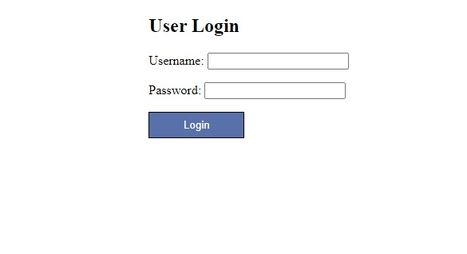
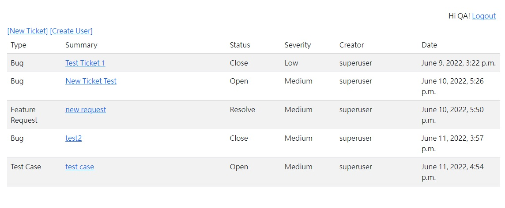
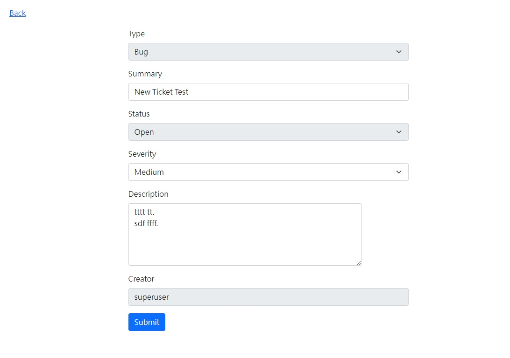

# TicketSystem w/ Django

## Screenshot




## Environment
1. Python3
1. Django 4.0.5
1. Run Test Server ```python3 ticketsys/manage.py runserver 0.0.0.0:8000```

## Usage
### Login URL
```http://[your ip]:[port]/```

### Test Accouts & Password
* ```RD``` / ```rd123456```
* ```QA``` / ```QA123456```
* ```PM``` / ```pm123456```
* ```ADMIN``` / ```admin123456```

### Phase I usage flow
1. QA Creates ticket by filling in ```New Ticket``` page
1. RD switches ticket to ```Resolve```
1. QA can swith to [Close] if QA acknowledges. If not, QA may switch back to ```Open```

### Phase II usage flow
* For QA
  1. QA creates ticket by filling in ```New Ticket``` page (type can select either ```Bug``` or ```Test Case```).
  2. QA can switch status to either ```Close``` or ```Open``` only when a RD swiches to ```Resolve```.
* For PM
  1. PM creates ticket by filling in ```New Ticket``` page (type will automatically select ```Feature Request```).
  2. PM can switch status to either ```Close``` or ```Open``` only when a RD swiches to ```Resolve```.
* For Administrator
  1. Administrator may create user by filling in ```Create User``` page.
  2. Administrator can create/modify ticket anytime.

## System Architecture
* User Model
  - Uses django default model
    - Groups including: RD, QA, PM, Administrator
* Ticket Model
  - title (string)
  - description (string)
  - status (enum)
  - t_type (enum)
  - severity (enum)
  - creator (django User class)
  - create_date (datetime)
* Pages
  - Login (templates/user_login.html)
  - Ticket List (templates/user_main.html)
  - Ticket Detail (templates/ticket_main.html)
  - User Create (templates/user_create.html)

## API Implementation Plan
* Authentication with access token in header

1. Return Ticket List
```
url: /api/tickets (GET)
body: {}
return: { {id, summary, type, status, create_date}, {...}, ... }
```

1. Get Specific Ticket Information
```
url: /api/ticket/{id} (GET)
body: {}
return: { id, summary, type, status, description, creator, create_date }
```

1. Create Ticket
```
url: /api/ticket/new (POST)
body: { summary, type, status, description }
return: {"status": OK|Error Msg}
```

1. Modify Ticket Content
```
url: /api/ticket/{id} (POST)
body: { summary, type, status, description }
return: {"status": OK|Error Msg}
```

1. Create User
```
url: /api/user/new (POST)
body: { username, password, role={RD|QA|PM} }
return: {"status": OK|Error Msg}
```

* Status Code
  1. 403: Authentication Failed
  1. 400, 404: Required Data not Found
  1. 500: Sever Error, please contact us
